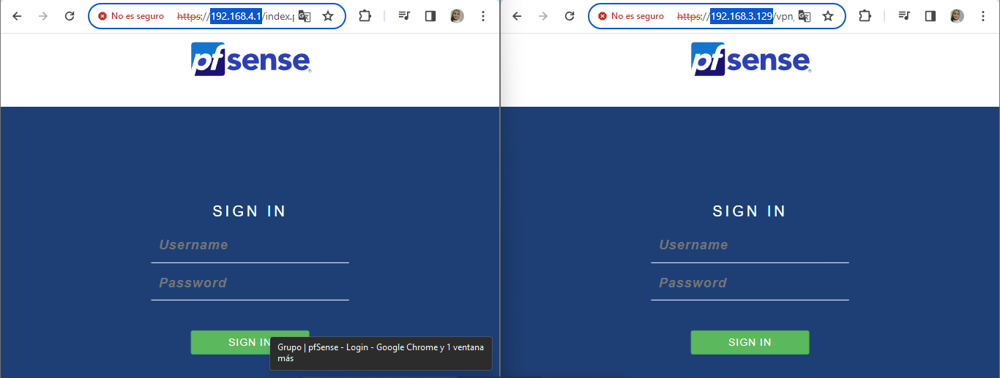
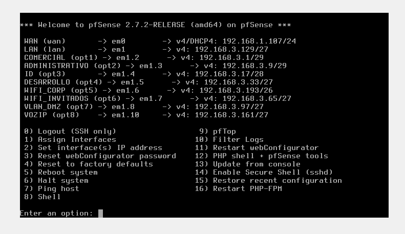
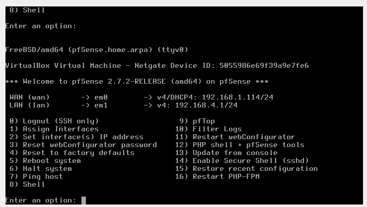
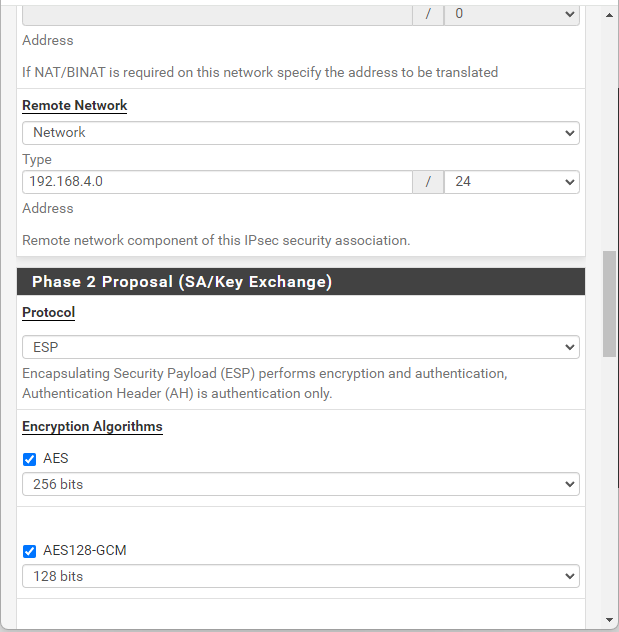
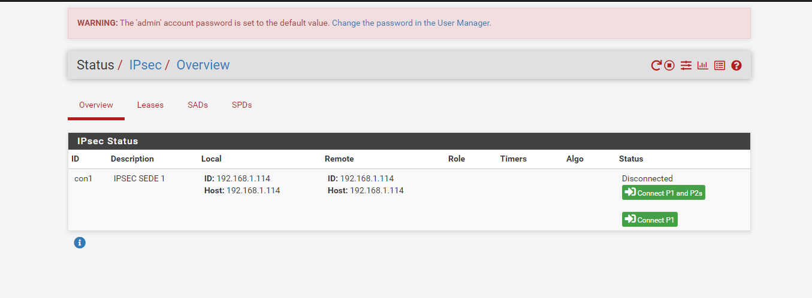
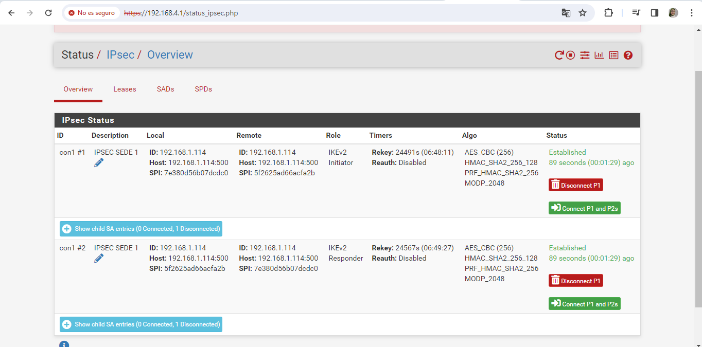
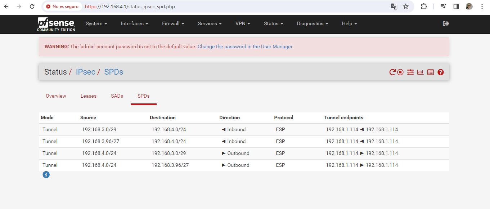
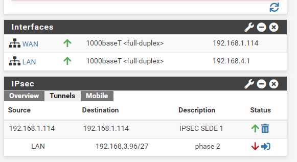
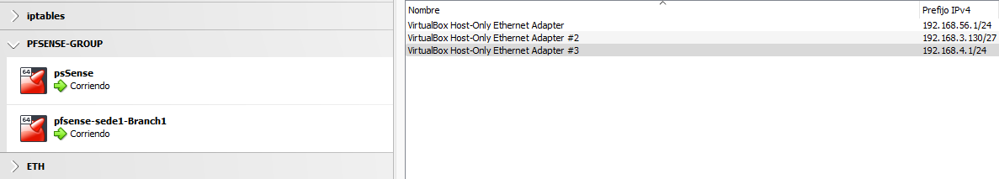

## IPsec-_Configuration_
### part 1: https://github.com/ImaneLamriui/Optimizing-Virtual-Networks-with-pfSense-Firewall  IP-Firewall: 192.168.3.129 (the main headquarters)
### part 2: The company has opened two new branches in other cities and wants us to connect them to the main headquarters through a secure channel. These branches also use pfSense as a firewall to manage their internal networks. The details of the new branches are as follows:

###### Branch 1:
__LAN__ IP Addressing: __192.168.4.0/24__

Public IP Address: unknown

###### Branch 2:
__LAN__ IP Addressing: __192.168.3.0/24__

Public IP Address: unknown

###### My source address is dynamically set (WAN): 192.168.1.1/24 (192.168.1.107).
###### Principal firewall address (LAN): 192.168.3.0 (192.168.3.129).
 
We need to configure the network in such a way that both branches can use __the accounting program__ and have access to __the Network Attached Storage (NAS)__ to meet the operational requirements of the company.

 

 

##### Prerequisites: 
We need additional pfSense appliances for each branch. Each branch would typically require its own pfSense firewall to manage its network and establish secure connections back to the main headquarters or other branches. 
Each pfSense device would then be configured to connect securely to the central location or other branches using VPN technologies like IPsec or OpenVPN. This allows for secure communication between all branches while providing __centralized management__ and security policies from __the main headquarters__,so,  We need to configure an additional network interfaces on those pfSense machines. 

Additionally, the pfSense machine I configure previously will be used as __the main headquarters__ on __part1__(Mentioned at the top of the document)

##### For a secure connection between pfSense machines using IPsec:
They typically need to share the same __pre-shared key (PSK)__ or utilize a certificate-based authentication method. 

This key or certificate is used to establish a secure communication channel between the two devices. 

pfSense can generate strong __pre-shared keys__ (PSKs) automatically, which simplifies the configuration process and ensures security. 
In this case I have used ths method to establish a secure IPsec connection __successfully__:
##### Press the 'Connect' button in the pfSense status section.:

##### estabilished connection successfully:

 

 

##### Then, we will see one activated tunnel displayed on the dashboard status

##### pfsence Configuration
When the initial installation is complete, reboot the machine, immediately halt the process, and proceed to delete the ISO file from the SATA. Additionally, disconnect the ISO from the controller in the VirtualBox configuration. This will prevent the ISO from reinstalling every time the pfSense machine starts.

#### _Conclusion_:

#### In this task, we have proceeded to:
###### -Create network interfaces (configure WAN and LAN).
###### -Define security policies.
###### -Configure firewall rules.
###### -Testing the connection functionality after completing the configurations: verifying connectivity between the branches, ensuring that security policies are functioning as expected, and confirming that services such as access to the local network and shared resources are available from remote branches.

